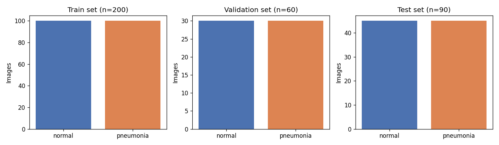
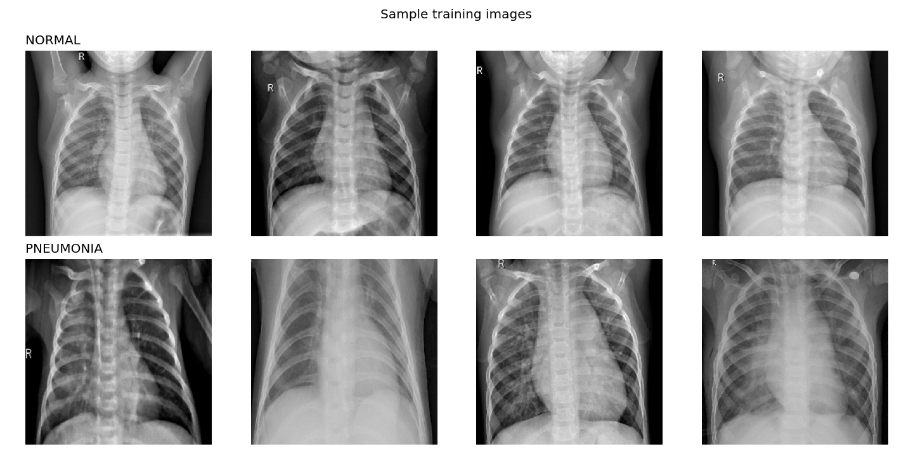
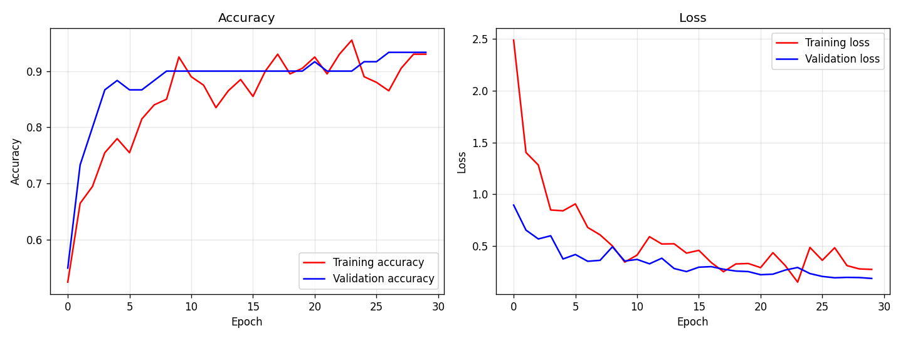
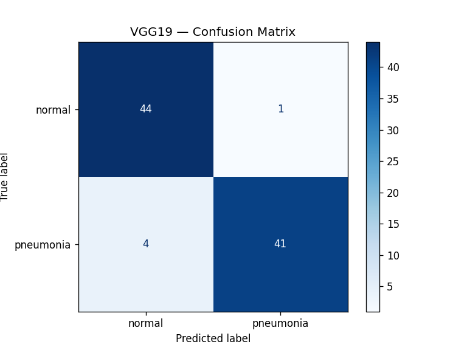
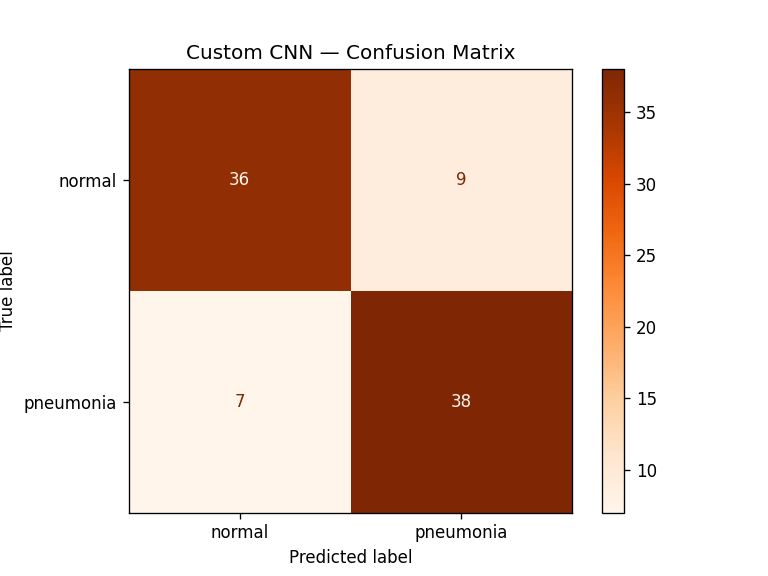
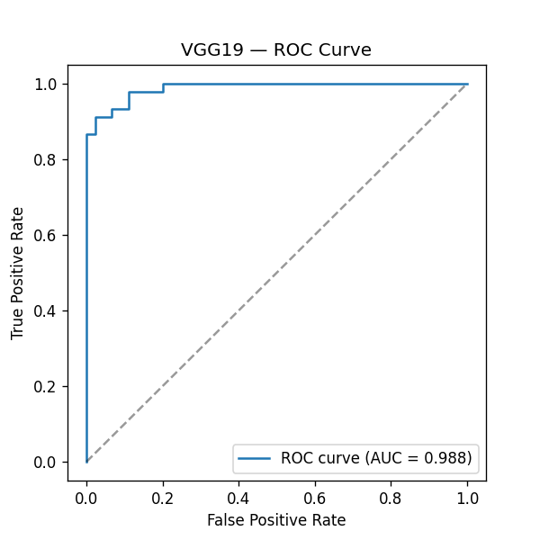
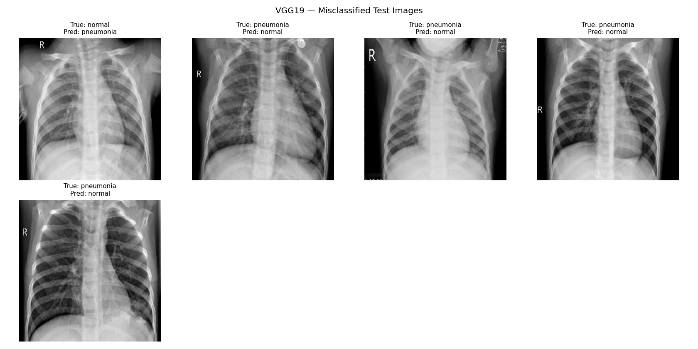
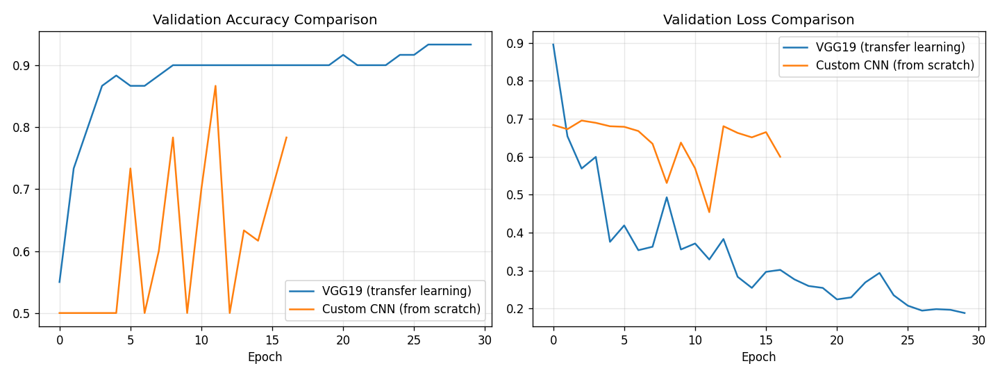
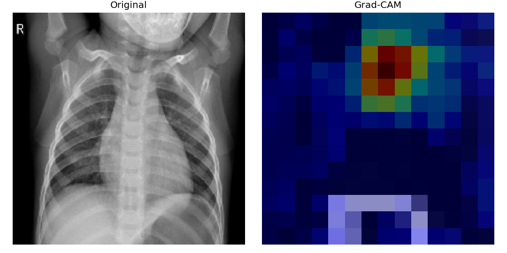

# Chest X-Ray Pneumonia Classification (VGG19 Transfer Learning + Custom CNN)

Binary classification of chest X-ray images into **NORMAL** vs **PNEUMONIA**, comparing
a VGG19 transfer-learning model against a CNN trained from scratch.

## Results

| Model | Val Accuracy | Test Accuracy | Notes |
|---|---|---|---|
| VGG19 (transfer learning) | *fill in after running* | *fill in* | Frozen ImageNet base + custom head |
| Custom CNN (from scratch) | *fill in* | *fill in* | Baseline for comparison |

*(Fill this table in with your actual numbers once you've run the notebook — recruiters
and reviewers look at this table first.)*

## Project Structure

```
.
├── notebooks/
│   └── VGG19_and_Custom_Model_Training.ipynb   # main notebook
├── models/            # saved .keras model files (gitignored — see below)
├── outputs/           # generated plots (confusion matrix, ROC curve, Grad-CAM, etc.)
├── data/              # dataset goes here locally (gitignored — not committed)
├── requirements.txt
├── .gitignore
└── README.md
```

## Dataset

Chest X-ray images, 2 classes (`normal`, `pneumonia`), pre-split into:

```
data/chest_x_ray/
├── traindata/{normal,pneumonia}       # 100 / 100 images
├── validationdata/{normal,pneumonia}  #  30 /  30 images
└── testdata/{normal,pneumonia}        #  45 /  45 images
```

The dataset is **not** committed to this repo (image datasets don't belong in git —
see `.gitignore`). Download/unzip it locally into `data/` before running the notebook,
or mount it from Google Drive if running in Colab.

## Setup

```bash
git clone https://github.com/<your-username>/<repo-name>.git
cd <repo-name>
python -m venv venv
source venv/bin/activate      # Windows: venv\Scripts\activate
pip install -r requirements.txt
```

Place the dataset under `data/chest_x_ray/` (see structure above), then open
`notebooks/VGG19_and_Custom_Model_Training.ipynb` in Jupyter or Colab. The notebook
auto-detects whether it's running in Colab (and mounts Drive at
`/content/drive/MyDrive/Colab Notebooks/chest_x_ray` if so) or locally (and uses
`./data/chest_x_ray`), so no path edits should be needed either way.

## Approach

1. **VGG19 transfer learning** — load VGG19 pretrained on ImageNet, freeze the
   convolutional base, and train a small custom classification head
   (`GlobalAveragePooling2D → Dense(256) → Dropout → Dense(2, softmax)`) on top.
   This reuses general-purpose visual features learned from ~1.2M ImageNet images,
   which matters a lot here since the training set is only 200 images.
2. **Custom CNN** — a 4-block conv net (16 → 32 → 64 → 128 filters, two conv layers
   per block) trained entirely from scratch on the same 200 images, included as a
   baseline to show the benefit of transfer learning on small datasets. Like the
   VGG19 head, it uses `GlobalAveragePooling2D` before the final dense layers rather
   than `Flatten`, to keep the parameter count manageable for such a small dataset.
3. Both models are evaluated with the same metrics: classification report, confusion
   matrix, ROC/AUC, and misclassified-example inspection. The VGG19 model additionally
   gets a Grad-CAM visualization for interpretability.

## Key Fixes Applied (from the original draft)

- Consistent `tensorflow.keras` imports throughout (was mixing `keras` and `tensorflow.keras`)
- Proper VGG19 `preprocess_input` normalization (was training on raw 0–255 pixels)
- `shuffle=False` on the test generator so predictions align with true labels
  (this was silently corrupting the confusion matrix/classification report)
- Data augmentation on the training set to reduce overfitting on a small dataset
- Fixed the custom CNN's final layers — it previously bottlenecked to a 2-unit ReLU
  Dense layer right before the softmax output, discarding almost all learned features
- Added `EarlyStopping` / `ModelCheckpoint` callbacks to both models, plus
  `ReduceLROnPlateau` for the VGG19 model
- Custom CNN is now actually compiled and trained (previously it was only built)
- Added model saving, ROC curve, misclassified-example grid, and Grad-CAM

## Visualizations Included

All plots below are generated by the notebook and saved to `outputs/`.

### Dataset

<table>
<tr>
<td width="50%">

**Class balance (train/val/test)**


</td>
<td width="50%">

**Sample training images per class**


</td>
</tr>
</table>

### Training

**Training / validation accuracy & loss curves (VGG19)**



### Evaluation

<table>
<tr>
<td width="50%">

**VGG19 confusion matrix**


</td>
<td width="50%">

**Custom CNN confusion matrix**


</td>
</tr>
</table>

**ROC curve with AUC (VGG19)**



**Misclassified test images — true vs. predicted label (VGG19)**



**Model comparison — VGG19 vs. custom CNN**



### Interpretability

**Grad-CAM heatmap** — highlights the region of the X-ray the VGG19 model used to make its decision




## Requirements

See `requirements.txt`. Core: `tensorflow`, `scikit-learn`, `matplotlib`, `numpy`.

## Disclaimer

This is an educational/portfolio project, not a validated diagnostic tool. It is
trained on a very small dataset (200 training images) and should not be used for
actual medical decision-making.

## License

MIT (or your choice — add a LICENSE file).
